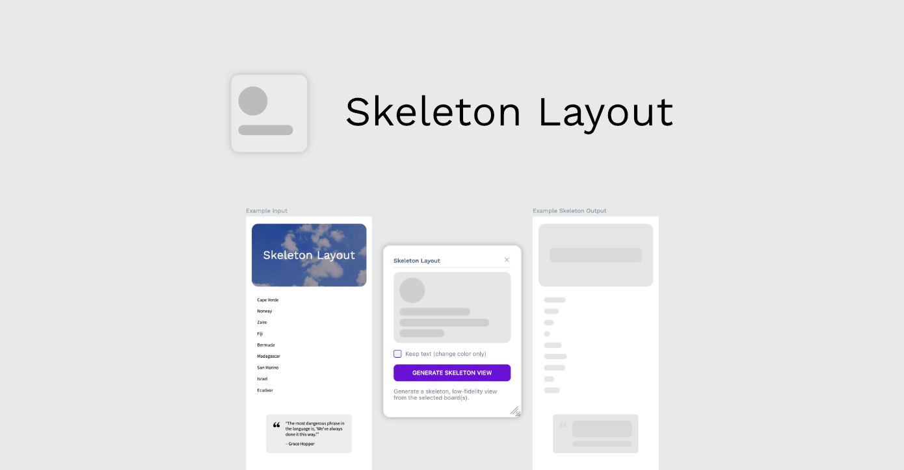

# Skeleton Layout Penpot Plugin

Turn your designs into low-fidelity concepts!

# Install on Penpot

Open the plugins modal in your Penpot project and add the next url

- https://penpot-skeleton-layout-plugin.netlify.app/manifest.json

Click install and you're setup! you can start turning your designs into low-fidelity concepts
